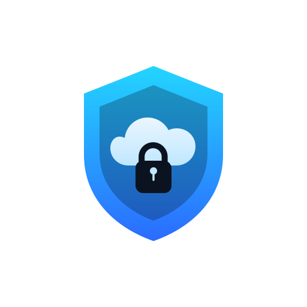

   

# Secure Drive

Security-focused cloud storage solution (semester project).
Currently in a very early **design** phase.

## Overview

Secure Drive combines a FastAPI backend, MinIO object storage, and PostgreSQL for metadata/auth. The frontend uses Vite + React during development and is served as static assets in production.

## Services

- FastAPI (Python)
- MinIO (S3-compatible object storage)
- PostgreSQL (metadata + auth)
- Frontend (Vite/React in dev, static in prod)

## Environments (Compose profiles)

This repository uses Docker Compose profiles to control which services run and whether they run in hot-reload mode or static mode:

- `postgres`
- `minio`
- `back-dev`
- `front-dev`
- `production`

Run `make` (or `make help`) in the project root directory to get started.

## Security goals (aspirational)

This project aims to explore “high-security by default” cloud storage concepts, including:

- Client-side encryption (CSE) and end-to-end encryption (E2EE)
- Zero-knowledge storage (server cannot read user content)
- Envelope encryption (per-file keys, wrapped by master/user keys)
- Strong authentication (MFA-ready), secure session handling, and least-privilege access control
- Robust authorization (RBAC/ABAC), object-level permissions, and audited access
- Key management strategy (rotation, revocation, backup/recovery), ideally HSM/KMS-compatible
- Secure sharing (time-bound links, scoped tokens, re-encryption on share, access revocation)
- Integrity protections (hashing, signatures, tamper-evident logs)
- Defense-in-depth (rate limiting, secure headers, secrets management, hardened containers)
- Privacy-aware telemetry and minimal data retention

These are design targets and may change as the architecture evolves.

## License

MIT

---
